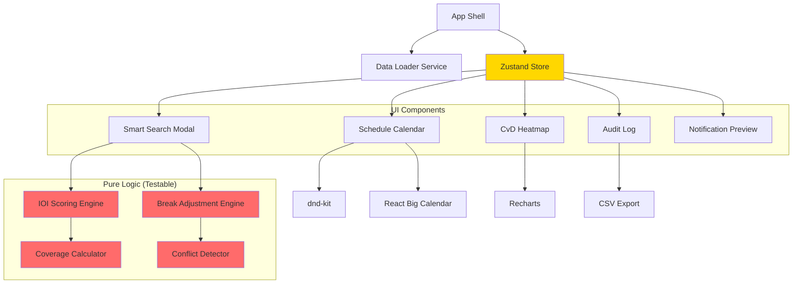

# Components

Based on the architectural patterns, tech stack, and data models, here are the major logical components.

## Component List

### App Shell

**Responsibility:** Root application component, handles initialization, routing, and global layout.

**Key Interfaces:**
- `useInitialization()` - Loads demo data on mount
- `<ErrorBoundary>` - Catches and displays runtime errors
- `<Layout>` - Header, navigation, main content area

**Dependencies:** DataLoader, Zustand store

**Technology Stack:** React 18, simple conditional rendering (no router needed)

---

### CvD Heatmap Component

**Responsibility:** Interactive capacity vs demand heatmap showing coverage by 15-minute intervals across 7 days.

**Key Interfaces:**
- `<CvDHeatmap data={cvdData} onCellClick={handleClick} />`
- `<HeatmapTooltip>` - Hover quick stats
- `<HeatmapDetailModal>` - Click detail popup

**Dependencies:**
- Recharts library
- CvDDataPoint[] from Zustand store
- Real-time recalculation on schedule changes

**Technology Stack:** Recharts, Tailwind CSS, Shadcn Dialog component

---

### Calendar Component

**Responsibility:** Outlook-style schedule grid with drag-drop, activity blocks, and filtered views.

**Key Interfaces:**
- `<ScheduleCalendar agents={filteredAgents} activities={activities} />`
- `<ActivityBlock>` - Individual calendar event
- `<AgentSidePanel>` - Agent list with filters
- Drag-drop handlers from dnd-kit

**Dependencies:**
- React Big Calendar library
- dnd-kit for drag-drop
- Activity[] and Agent[] from store

**Technology Stack:** React Big Calendar, dnd-kit, Shadcn components

---

### Smart Search Component

**Responsibility:** IOI-powered slot recommendation wizard with break adjustment proposals.

**Key Interfaces:**
- `<SmartSearchModal>` - Wizard dialog
- `<SlotRecommendationsList>` - Top 5 ranked slots with scores
- `<IOIScoreBreakdown>` - Expandable factor details
- `<BreakAdjustmentProposal>` - Before/after comparison

**Dependencies:**
- IOI Calculator (business logic)
- Break Adjuster (business logic)
- Zustand store

**Technology Stack:** React hooks, Zustand, Shadcn Dialog/Accordion

---

### IOI Scoring Engine

**Responsibility:** Pure function module for calculating Intelligent Opportunity Index scores.

**Key Interfaces:**
- `calculateIOI(slot, agents, cvdData, rules): IOIResult`
- `scoreCvDSafety()` - 0-30 points
- `scoreAvailabilityDensity()` - 0-25 points
- `scoreComplianceIntegrity()` - 0-25 points
- `scoreBasicFairness()` - 0-20 points

**Dependencies:**
- Data models (Agent, CvDDataPoint, ComplianceRule)
- date-fns for time calculations
- No UI dependencies (pure logic)

**Technology Stack:** TypeScript pure functions, Vitest for unit tests

---

### Break Adjustment Engine

**Responsibility:** Proposes compliant break moves when no conflict-free slots exist.

**Key Interfaces:**
- `proposeBreakAdjustments(agents, slot, rules): BreakAdjustment[]`
- `validateCompliance(adjustment, rules): ComplianceCheck`

**Dependencies:**
- Data models (Activity, ComplianceRule)
- date-fns for time math
- Conflict detector

**Technology Stack:** TypeScript pure functions, Vitest

---

### Coverage Calculator

**Responsibility:** Real-time computation of capacity vs demand percentages.

**Key Interfaces:**
- `calculateCoverage(interval, agents, activities): number`
- `recalculateAllCvD(agents, activities, forecast): CvDDataPoint[]`

**Dependencies:**
- Agent schedules
- Activities
- Forecast data

**Technology Stack:** TypeScript, date-fns, memoized with useMemo

---

### Audit Log Component

**Responsibility:** Event log table with filters, CSV export, and transparency.

**Key Interfaces:**
- `<AuditLog entries={logEntries} />`
- `<AuditLogFilters>` - Date range, action type, agent search
- `exportToCSV()` - Download function

**Dependencies:**
- AuditLogEntry[] from Zustand store
- Shadcn Table component

**Technology Stack:** React, Shadcn Table, date-fns

---

### State Management (Zustand Store)

**Responsibility:** Global application state, actions, and computed values.

**Key Interfaces:**
- `useStore()` - Main hook for all components
- Store slices: agents, activities, cvdData, rules, auditLog, ui
- Actions: addActivity, updateActivity, deleteActivity, resetDemo

**Dependencies:** Zustand library, Immer middleware

**Technology Stack:** Zustand 4.5+

---

## Component Diagram

---
