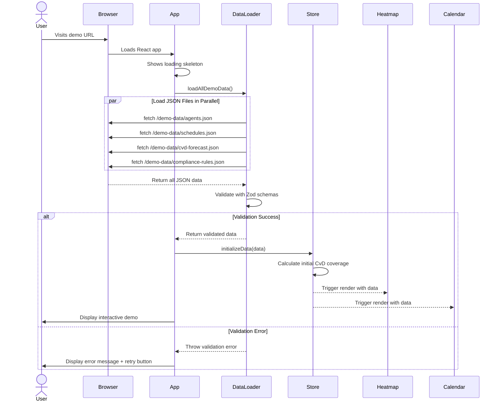
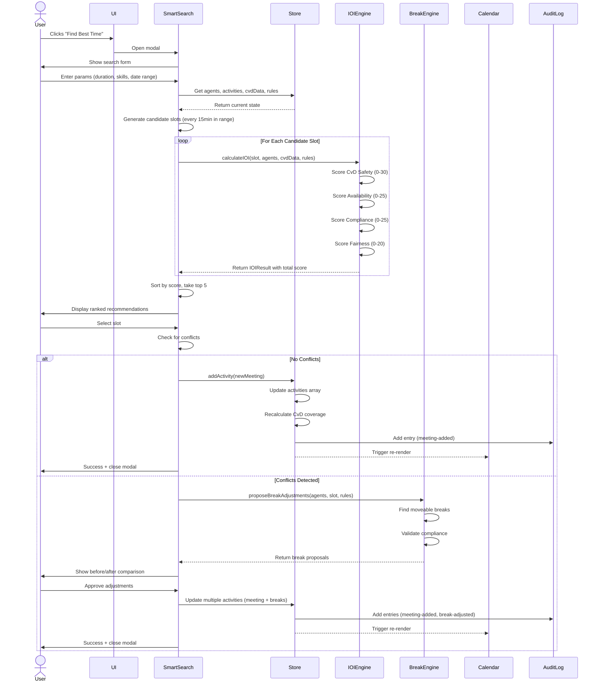
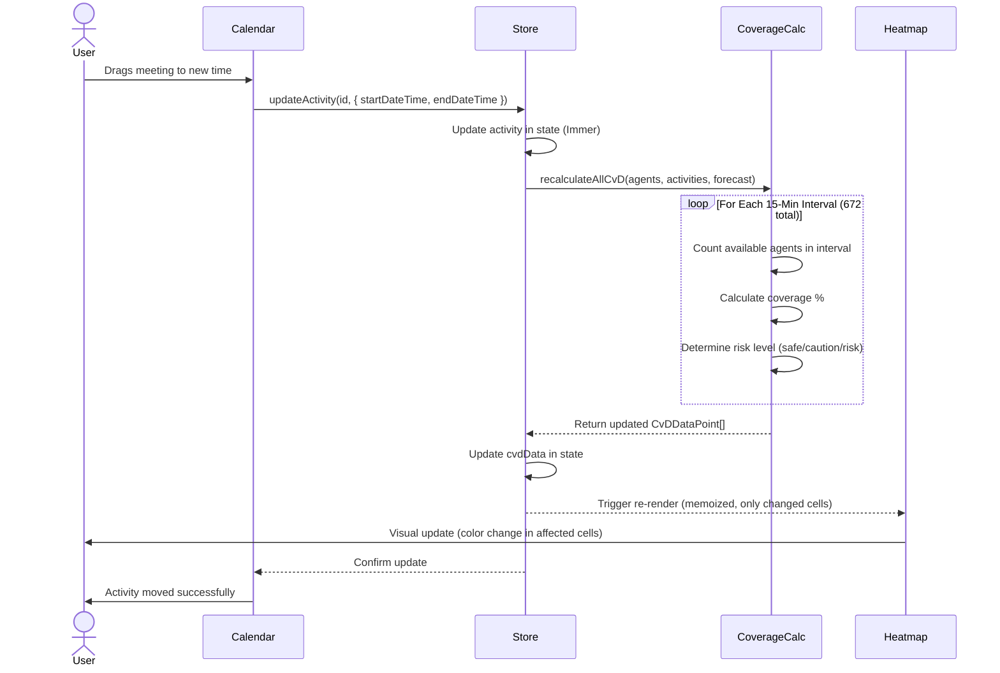

# Core Workflows

Key user journeys illustrated with sequence diagrams showing component interactions.

## Application Initialization Flow

**Performance Target:** < 2 seconds from URL load to interactive (FR20)

---

## Smart Search Workflow (IOI-Driven Slot Recommendation)

**Performance Target:** IOI calculation for 50+ slots < 500ms (NFR3)

---

## Real-Time CvD Heatmap Update Flow

**Performance Target:** < 200ms interaction latency (NFR2)

---
