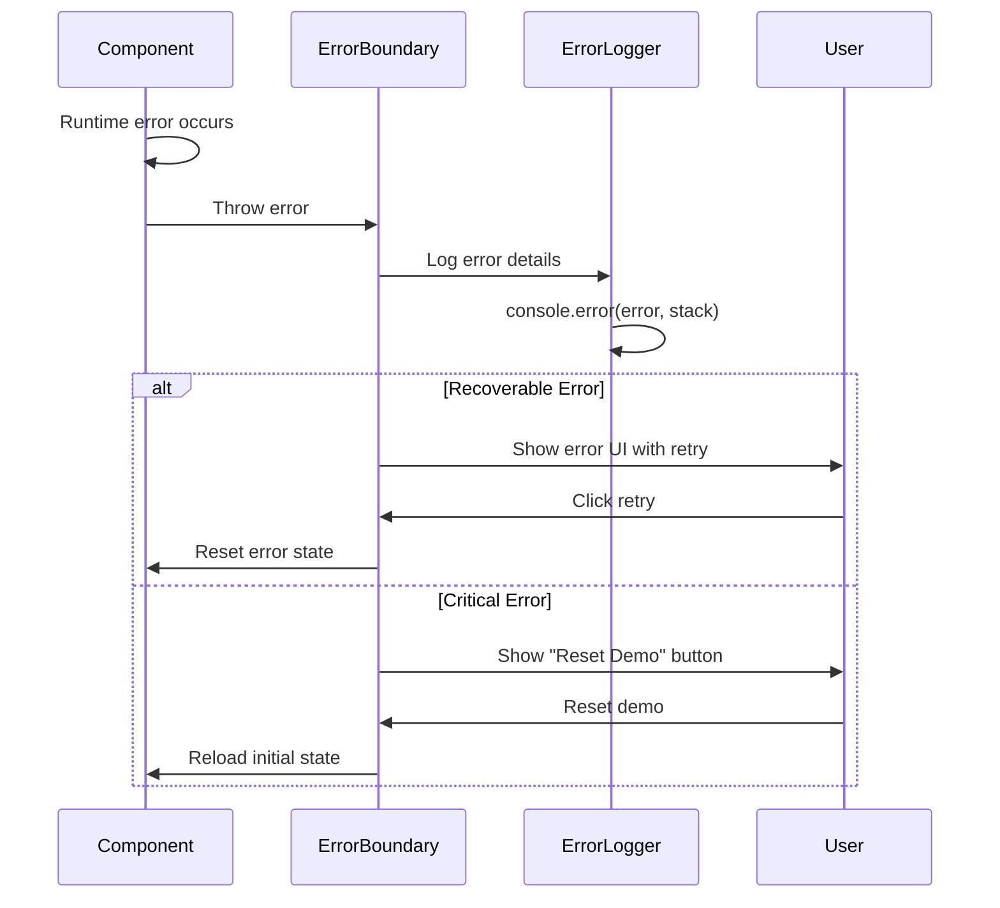

# Error Handling Strategy

## Error Flow



## Error Response Format

```typescript
// Standard error interface
interface AppError {
  code: string;
  message: string;
  details?: Record<string, any>;
  timestamp: string;
  recoverable: boolean;
}
```

## Frontend Error Handling

```typescript
// src/components/Layout/ErrorBoundary.tsx
export class ErrorBoundary extends React.Component<Props, State> {
  static getDerivedStateFromError(error: Error): State {
    return { hasError: true, error };
  }

  componentDidCatch(error: Error, errorInfo: React.ErrorInfo) {
    console.error('ErrorBoundary caught error:', error, errorInfo);
  }

  render() {
    if (this.state.hasError) {
      return (
        <div className="error-screen">
          <h1>Something Went Wrong</h1>
          <button onClick={this.handleReset}>Reset Demo</button>
        </div>
      );
    }

    return this.props.children;
  }
}
```

---
