# High Level Architecture

## Technical Summary

The **Intelligent WFM Scheduling Demo** uses a **Jamstack client-side architecture** where all intelligence runs in the browser. The React 18+ TypeScript application loads demo data from **JSON files** (agents, schedules, forecasts, compliance rules), processes IOI scoring and break optimization algorithms client-side, and deploys to **Vercel's free tier** for zero-cost global hosting with shareable web URLs. This architecture eliminates backend complexity while delivering enterprise-grade UX with interactive CvD heatmaps, smart scheduling workflows, and real-time visual feedback. JSON-based data enables version control and easy modification for different demo scenarios.

## Platform and Infrastructure Choice

**Platform:** Vercel (Free Tier)

**Key Services:**
- **Vercel Edge Network** - Global CDN for <100ms asset delivery
- **Vercel Static Hosting** - Zero-config React SPA deployment
- **GitHub Integration** - Auto-deploy from `main` branch
- **Preview Deployments** - Unique URLs for every PR (demo variations)

**Deployment Host and Regions:** Global Edge Network (automatic worldwide distribution)

**Why Vercel for This Demo:**
- ✅ **Free forever** for personal/demo projects (unlimited bandwidth)
- ✅ **Zero configuration** - detects Vite automatically
- ✅ **Instant deploys** (30-60 seconds from git push to live URL)
- ✅ **Custom domains free** (can use wfm-demo.vercel.app or custom)
- ✅ **Preview URLs** for testing different datasets without affecting production
- ✅ **No credit card required** for free tier

## Repository Structure

**Structure:** Monorepo (Single Package)

**Monorepo Tool:** N/A (Simple single-app structure, no workspace complexity needed)

**Package Organization:**

Given this is a demo with no backend and JSON-based data, we use a **simplified single-app structure**:

```
/wfm-intelligence-demo
  /src                    (React app - all TypeScript)
  /public
    /demo-data           (JSON files - version controlled!)
      agents.json
      schedules.json
      cvd-forecast.json
      compliance-rules.json
  package.json
  vite.config.ts
  README.md
```

**Rationale:**
- **JSON over CSV**: Native browser parsing, TypeScript-first, nested data structures supported
- **No monorepo complexity**: Single deployable unit = simpler CI/CD
- **Public folder**: Vercel serves `/public` as static assets (JSON files load via fetch)

## High Level Architecture Diagram

```mermaid
graph TB
    User[👤 Demo Viewer]
    Browser[🌐 Web Browser]
    Vercel[☁️ Vercel Edge CDN]
    JSONData[(📊 JSON Files<br/>agents.json<br/>schedules.json<br/>cvd-forecast.json<br/>compliance-rules.json)]

    User -->|Accesses| Vercel
    Vercel -->|Serves| Browser
    Browser -->|Loads| JSONData

    subgraph "Client-Side Runtime (Browser)"
        Browser
        React[⚛️ React App]
        StateStore[🗄️ Zustand Store]
        JSONParser[📄 Native JSON.parse]
        IOIEngine[🧠 IOI Scoring Engine]
        BreakOptimizer[⚙️ Break Adjustment Logic]
        CvDCalc[📈 Coverage Calculator]

        Browser --> React
        React --> StateStore
        React --> JSONParser
        JSONParser --> JSONData
        StateStore --> IOIEngine
        StateStore --> BreakOptimizer
        StateStore --> CvDCalc
    end

    style Browser fill:#e1f5ff
    style Vercel fill:#000000,color:#fff
    style JSONData fill:#4CAF50,color:#fff
    style IOIEngine fill:#FF9800,color:#fff
```



## Architectural Patterns

- **Jamstack Architecture:** Static site generation with client-side business logic - _Rationale:_ Zero backend cost, instant global CDN distribution, perfect for interactive demos that don't need persistence

- **Component-Based UI:** Reusable React components with TypeScript interfaces - _Rationale:_ Maintainability and type safety across complex UI (heatmaps, calendars, modals)

- **JSON-as-Database Pattern:** Static JSON files replacing traditional database - _Rationale:_ Zero infrastructure, version controlled data, native browser parsing, TypeScript-first validation

- **Client-Side Service Layer:** Business logic modules (IOI calculator, break adjuster) separate from UI - _Rationale:_ Testable pure functions, clear separation of concerns despite no backend

- **Immutable State Management:** Zustand store with immutable updates - _Rationale:_ Predictable state changes critical for real-time heatmap/calendar synchronization

- **Progressive Enhancement:** Core demo works without advanced browser features, enhanced UX for modern browsers - _Rationale:_ Maximum compatibility for stakeholder demos on various devices

---
