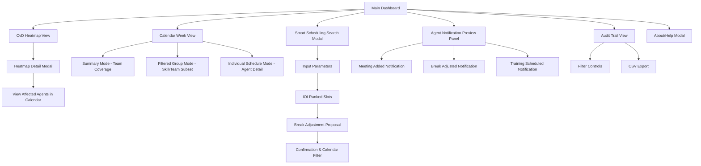
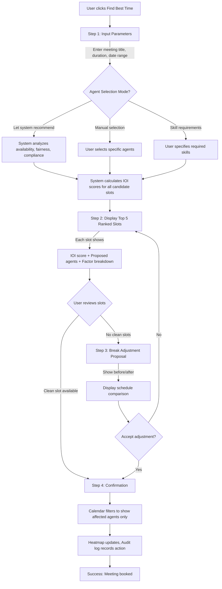
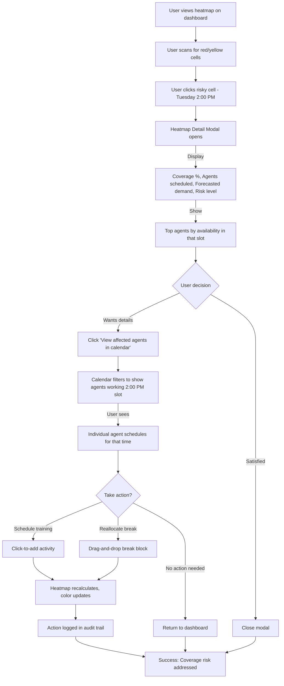
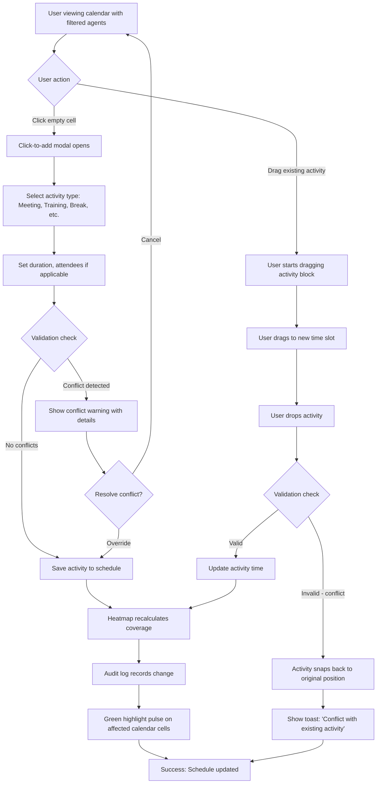

# Intelligent WFM Scheduling Demo UI/UX Specification

## Introduction

This document defines the user experience goals, information architecture, user flows, and visual design specifications for **Intelligent WFM Scheduling Demo**'s user interface. It serves as the foundation for visual design and frontend development, ensuring a cohesive and user-centered experience.

### Overall UX Goals & Principles

#### Target User Personas

**WFM Planner (Primary Persona):**
Contact center workforce planners who currently spend 30-45 minutes manually finding meeting slots for 10 agents. They need visibility into service level impact when scheduling activities. Pain points include no CvD integration in existing WFM platforms (NICE, Verint, Calabrio) and no AI-driven recommendations.

**Demo Viewer/Stakeholder (Secondary Persona):**
Potential clients, partners, or portfolio reviewers viewing a 5-10 minute demonstration. They need to quickly grasp the intelligent scheduling concept and see the "wow factor" of CvD-integrated IOI scoring. They expect enterprise software quality, not prototype aesthetics.

#### Usability Goals

1. **Ease of learning:** First-time viewers can understand core functionality within the 5-10 minute demo without detailed walkthrough (NFR12)
2. **Efficiency of use:** WFM planners can find optimal meeting slots within 2-3 clicks using Smart Search workflow
3. **Error prevention:** System only proposes compliant break adjustments (NFR9), validates all inputs, shows clear feedback
4. **Immediate understanding:** All interactions provide visual confirmation within 200ms (NFR2)
5. **Demo flow continuity:** Reset button enables multiple demonstration run-throughs without crashes (FR23, NFR15)

#### Design Principles

1. **Intelligent focus over mass visibility** - Surface relevant agents based on context (skills, availability, IOI scoring) rather than overwhelming with all 50-100 agents simultaneously
2. **Clarity over cleverness** - Critical information (IOI scores, coverage %, compliance status) always visible and understandable at a glance
3. **Progressive disclosure** - Start with aggregated/summary views, drill down to individual schedules on demand
4. **Immediate feedback** - Every action has clear visual confirmation within 200ms
5. **Data-driven confidence** - Show the math behind recommendations (explainable IOI breakdowns) to build trust

#### Change Log

| Date | Version | Description | Author |
|------|---------|-------------|--------|
| 2025-10-18 | 1.0 | Initial UI/UX specification created from PRD | Sally (UX Expert) |

## Information Architecture (IA)

### Site Map / Screen Inventory

### Navigation Structure

**Primary Navigation:**
Top-level tabs or segmented control switching between main views:
- Dashboard (default) - Split view with heatmap left, calendar right
- Audit Trail - Full-width event log table
- About/Help - Modal overlay (not persistent tab)

**Secondary Navigation:**
Contextual controls within each view:
- **Calendar View Mode Switcher:** Summary / Filtered Group / Individual Schedules (radio buttons or dropdown)
- **Agent Filter Panel:** Collapsible sidebar with search, skill filters, team filters, "Show All" toggle
- **Agent Grouping Controls:** "Top 10 by availability", "Selected skill group", "Custom selection" (dropdown or button group)

**Breadcrumb Strategy:**
Given the shallow hierarchy (2-3 levels deep) and modal-driven workflows, breadcrumbs are **not required**. Instead:
- **Modal titles** show context (e.g., "Tuesday 2:00 PM - Coverage Details" in heatmap modal)
- **Back/Close buttons** on modals with clear labels
- **Filtered state indicators** in calendar header (e.g., "Showing 8 agents: Technical Support Team")

## User Flows

### Flow 1: Smart Search - Find Optimal Meeting Time

**User Goal:** Schedule a team meeting with minimal service level impact using AI-driven recommendations

**Entry Points:**
- "Find Best Time" button on main dashboard
- "Add Meeting" → "Use Smart Search" option

**Success Criteria:** Meeting booked with IOI score > 80, compliant break adjustments (if needed), affected agents visible in calendar

#### Flow Diagram

#### Edge Cases & Error Handling

- **No available slots:** System displays "No slots found with IOI > 50. Try widening date range or reducing attendee count."
- **All slots require break adjustment:** Clearly indicate compliance status, prevent booking if adjustment violates labor rules
- **Conflicting existing meeting:** Detect overlap, show conflict warning, suggest alternative slots
- **Invalid duration:** Validate input (minimum 15 min, maximum 4 hours), show inline error message
- **Insufficient agents with required skills:** Display "Only 3 agents available with [Spanish + Technical]. Need 5. Adjust requirements?"

**Notes:** This flow demonstrates the core "intelligent scheduling" differentiator. The system does the heavy lifting (IOI calculation, agent recommendation, break optimization), while the user makes final decisions with full transparency.

---

### Flow 2: Heatmap Exploration to Contextual Scheduling

**User Goal:** Identify risky coverage periods and take immediate scheduling action

**Entry Points:**
- Main dashboard heatmap view (always visible)

**Success Criteria:** User understands coverage risk, drills into details, and either accepts risk or schedules mitigation action

#### Flow Diagram

#### Edge Cases & Error Handling

- **Heatmap cell has 100% coverage (green):** Detail modal still opens, shows "Safe coverage. No action needed." message
- **No agents scheduled in clicked interval:** Display "No agents scheduled. Forecasted demand: X calls. Coverage: 0%"
- **Filtered calendar shows 50+ agents:** Apply virtual scrolling, show "Showing top 20 agents. Load more..." pagination
- **Real-time heatmap update delay:** Show loading skeleton during recalculation, ensure < 500ms per NFR3

**Notes:** This flow showcases "progressive disclosure" - start with high-level heatmap visualization, drill down on demand. The "View affected agents in calendar" button bridges heatmap and calendar views seamlessly.

---

### Flow 3: Manual Calendar Activity Management

**User Goal:** Quickly add or move activities directly in the calendar view

**Entry Points:**
- Calendar week view on main dashboard
- After filtering agents via search/skill filter

**Success Criteria:** Activity added or moved without conflicts, calendar and heatmap stay synchronized

#### Flow Diagram

#### Edge Cases & Error Handling

- **Drag activity outside calendar bounds:** Activity snaps back, show "Cannot move activity outside current week view"
- **Multi-agent activity (meeting) drag:** Confirm "Move for all 8 attendees?" before updating
- **Break duration violation:** Prevent creating breaks < 15 min or > 60 min, show inline validation
- **Compliance rule violation:** Detect if break move creates 5+ hour gap without break, block save, explain why
- **Concurrent edit (edge case for demo):** Not applicable - single-user demo, but note for production consideration

**Notes:** This flow emphasizes "immediate feedback" principle - all drag-and-drop interactions show visual affordances (ghost preview, snap-to-grid, pulse animations) within 200ms per NFR2.

## Wireframes & Mockups

**Primary Design Files:** To be created in Figma (recommended) or similar design tool. The specification below provides layout guidance for implementation.

### Key Screen Layouts

#### Screen 1: Main Dashboard

**Purpose:** Primary landing view providing at-a-glance service level risk awareness and calendar management

**Key Elements:**
- **Header bar:** App title "WFM Intelligence Demo", date picker (week selector), "Find Best Time" button, "Add Activity" button, Reset Demo button
- **Left panel (40% width):** CvD Heatmap - 7 days (columns) × 15-minute intervals 7am-7pm (rows), color-coded cells (red/yellow/green), hover tooltips
- **Right panel (60% width):** Calendar view with mode switcher (Summary/Filtered/Individual), agent filter panel (collapsible), time grid
- **Footer:** Version info "v2.0, Built Oct 2025", About/Help link
- **Layout:** Split-screen responsive layout, heatmap fixed left, calendar scrollable right

**Interaction Notes:**
- Heatmap cells clickable → opens detail modal
- Calendar view mode switcher → toggles between team summary bars and individual agent rows
- Agent filter panel → accordion-style filters for skills, teams, availability

**Design File Reference:** Figma frame "Dashboard - Main View" (to be created)

---

#### Screen 2: CvD Heatmap Detail Modal

**Purpose:** Deep-dive into specific time interval coverage metrics

**Key Elements:**
- **Modal header:** "Tuesday 2:00 PM - Coverage Details", close button (X)
- **Metrics section:** Large coverage percentage (e.g., "87%"), risk indicator (yellow triangle icon), agents scheduled count, forecasted demand
- **Skills breakdown:** Horizontal bar chart showing agent skills distribution for this interval
- **Top agents list:** Expandable list (5-10 agents) with avatars, names, status badges ("Available", "Scheduled meeting")
- **Action button:** "View Affected Agents in Calendar" (primary CTA)
- **Layout:** Centered modal 600px width, max-height with scroll if needed

**Interaction Notes:**
- Click "View Affected Agents in Calendar" → closes modal, filters calendar to show agents working this time slot
- Click outside modal or X → closes modal, returns to dashboard

**Design File Reference:** Figma frame "Heatmap Detail Modal" (to be created)

---

#### Screen 3: Smart Scheduling Search Modal (4-step wizard)

**Purpose:** IOI-driven slot recommendation workflow with dynamic agent selection

**Key Elements:**

**Step 1 - Input Parameters:**
- **Form fields:** Meeting title (text), Duration (dropdown: 15min/30min/1hr/2hr), Date range (date picker), Priority (dropdown: Low/Medium/High)
- **Agent selection mode:** Radio buttons - "Let system recommend" (default), "Manual selection", "Skill requirements"
- **Navigation:** "Next" button (primary), "Cancel" button (secondary)

**Step 2 - IOI Ranked Slots:**
- **Top 5 slots list:** Card layout, each showing:
  - IOI score badge (large, color-coded: green 80+, yellow 60-79, orange <60)
  - Date/time (e.g., "Tuesday, Oct 22 @ 2:00 PM")
  - Proposed agents (mini-avatars + names, e.g., "Sarah, Mike, Lisa, John, Emma")
  - Expandable factor breakdown (4 bars: CvD Safety, Availability, Compliance, Fairness)
- **Navigation:** "Select" button per slot, "Back" button

**Step 3 - Break Adjustment Proposal (conditional):**
- **Before/After comparison:** Side-by-side schedule view, changed blocks highlighted
- **Explanation text:** "To accommodate this meeting, we propose moving Sarah's break from 2:00 PM to 3:30 PM (compliant: 2hr spacing maintained)"
- **Navigation:** "Accept Adjustment" (primary), "Choose Different Slot" (secondary)

**Step 4 - Confirmation:**
- **Success message:** "Meeting booked! IOI Score: 92"
- **Impact summary:** "8 agents scheduled, Coverage updated to 98%"
- **Auto-action:** Calendar filters to show affected agents, heatmap updates
- **Navigation:** "Done" button

**Interaction Notes:**
- Multi-step wizard maintains state, allows back navigation
- Expandable factor breakdowns show tooltips explaining each IOI component
- If no break adjustment needed, skip Step 3

**Design File Reference:** Figma frames "Smart Search - Step 1", "Step 2", "Step 3", "Step 4" (to be created)

---

#### Screen 4: Calendar Week View (Filtered Group Mode)

**Purpose:** Manage and visualize filtered agent schedules for selected context

**Key Elements:**
- **View mode switcher:** Segmented control - Summary / Filtered Group (active) / Individual
- **Agent filter panel (left sidebar, 250px):** Search bar, skill checkboxes (Technical, Spanish, Sales, etc.), team dropdown, "Top 10 by availability" button
- **Filtered state indicator:** Header badge "Showing 8 agents: Technical Support Team" with clear/reset icon
- **Time grid:**
  - Rows: Agent names with mini-avatars (8 visible agents)
  - Columns: 15-minute intervals, 7am-7pm
  - Activity blocks: Color-coded (shifts blue, breaks orange, lunch purple, meetings green, training teal)
- **Interaction affordances:** Drag handles on activity blocks, click-to-add cursor on empty cells, multi-select checkboxes per agent

**Interaction Notes:**
- Drag activity block → ghost preview follows cursor, snaps to 15-min grid, drops or snaps back if invalid
- Click empty cell → click-to-add modal opens
- Agent checkboxes → multi-select for bulk actions (future enhancement noted)

**Design File Reference:** Figma frame "Calendar - Filtered Group View" (to be created)

---

#### Screen 5: Audit Trail View

**Purpose:** Event log for accountability and decision traceability

**Key Elements:**
- **Filter controls (top bar):** Date range picker, Action type dropdown (All/Meeting Added/Break Adjusted/Training Scheduled), User filter (demo shows single user), Agent search
- **Event table:** Columns - Timestamp, Action, Affected Agents (avatars + count), IOI Score, Coverage Impact (±%), Rationale
- **Sortable headers:** Click column header to sort ascending/descending
- **CSV export button:** "Export to CSV" (secondary button, top-right)
- **Pagination:** "Showing 1-25 of 147 events" with prev/next buttons

**Interaction Notes:**
- Click agent avatar in "Affected Agents" column → filters calendar to show that agent's schedule
- CSV export downloads full filtered dataset
- Table supports horizontal scroll on narrow viewports

**Design File Reference:** Figma frame "Audit Trail Table View" (to be created)

## Component Library / Design System

**Design System Approach:** Leverage **Shadcn/ui** component library with **Tailwind CSS** for styling. Shadcn provides accessible, customizable React components that can be copied into the project and modified as needed. This approach balances professional aesthetics with rapid development for demo scope.

### Core Components

#### Component: Button

**Purpose:** Primary interaction trigger for all user actions

**Variants:**
- **Primary:** Teal/cyan background (accent color), white text - used for main CTAs ("Find Best Time", "Next", "Accept Adjustment")
- **Secondary:** Slate border, slate text - used for alternative actions ("Cancel", "Back", "Choose Different Slot")
- **Ghost:** Transparent background, slate text - used for tertiary actions (close buttons, "Skip")
- **Destructive:** Red background, white text - used for critical actions ("Delete", "Override Conflict")

**States:** Default, Hover (darker shade), Active (pressed), Disabled (gray, 50% opacity), Focus (2px teal outline)

**Usage Guidelines:**
- Maximum one primary button per view/modal to maintain clear visual hierarchy
- Minimum touch target 44px × 44px for accessibility
- Always include focus indicators for keyboard navigation

---

#### Component: Modal / Dialog

**Purpose:** Contextual overlays for detail views, wizards, and confirmations

**Variants:**
- **Small (400px width):** Confirmation dialogs, simple forms
- **Medium (600px width):** Heatmap detail modal, agent notifications preview
- **Large (900px width):** Smart Search wizard, break adjustment comparison
- **Full-screen (mobile/tablet):** All modals on narrow viewports

**States:** Open, Closing (fade-out animation), Closed

**Usage Guidelines:**
- Include close button (X) in top-right corner, always
- Support ESC key to close, click-outside to close (with exceptions for multi-step wizards)
- Maintain focus trap within modal for accessibility
- Use overlay backdrop (black, 40% opacity) to dim background content

---

#### Component: Card

**Purpose:** Grouped content containers for slots, metrics, notifications

**Variants:**
- **Default:** White background, subtle shadow (2px), 8px border radius
- **Highlighted:** Teal border (2px), used for selected/recommended items
- **Danger:** Red border (2px), used for conflict warnings
- **Flat:** No shadow, border-only, used for compact list items

**States:** Default, Hover (shadow increases to 4px), Active (border highlight), Disabled (gray background)

**Usage Guidelines:**
- Use generous padding (16-24px) for breathing room
- Maintain consistent border radius across all cards (8px)
- IOI slot cards should include expandable sections (factor breakdowns)

---

#### Component: Table

**Purpose:** Structured data display for audit log, agent lists

**Variants:**
- **Striped:** Alternating row backgrounds (white/slate-50) for readability
- **Bordered:** Cell borders for dense data
- **Compact:** Reduced padding for large datasets
- **Responsive:** Horizontal scroll on narrow viewports

**States:** Default row, Hover row (slate-100 background), Selected row (teal-50 background)

**Usage Guidelines:**
- Sortable columns indicated by arrow icons in header
- Sticky header when scrolling vertically
- Paginate if >25 rows, use "Showing X-Y of Z" indicator
- Support keyboard navigation (arrow keys, tab)

---

#### Component: Badge

**Purpose:** Status indicators, labels, counts

**Variants:**
- **Default:** Gray background, dark text - general labels
- **Success (Green):** IOI scores 80+, compliant status, high coverage
- **Warning (Yellow):** IOI scores 60-79, caution status, tight coverage
- **Danger (Red/Orange):** IOI scores <60, non-compliant, low coverage
- **Info (Blue):** Informational tags, skill labels

**States:** Static only (badges don't have interactive states)

**Usage Guidelines:**
- Keep text concise (1-3 words maximum)
- Use consistent sizing: Small (text-xs), Medium (text-sm), Large (text-base)
- IOI score badges should be large and prominent (48px height minimum)

---

#### Component: Tooltip

**Purpose:** Contextual help text and additional information on hover

**Variants:**
- **Default:** Dark background (slate-900), white text, 4px border radius
- **Large:** For detailed explanations (max-width 300px, wrapping text)

**States:** Hidden, Visible (on hover, 150ms delay), Keyboard-triggered (on focus)

**Usage Guidelines:**
- Position automatically based on available space (top/bottom/left/right)
- Include small arrow pointing to trigger element
- Avoid putting critical information only in tooltips (accessibility)
- Heatmap tooltips should appear immediately (no delay) for data exploration

---

#### Component: Heatmap Cell

**Purpose:** Visual representation of coverage percentage in CvD heatmap

**Variants:**
- **Green (>105% coverage):** #10b981 background (green-500)
- **Yellow (90-105% coverage):** #f59e0b background (amber-500)
- **Red (<90% coverage):** #ef4444 background (red-500)
- **Empty (no data):** #f3f4f6 background (gray-100)

**States:** Default, Hover (border highlight + tooltip), Active (clicked, modal opens), Focus (keyboard nav, border outline)

**Usage Guidelines:**
- Minimum cell size 32px × 32px for touch targets
- Include subtle border (1px gray-300) for cell separation
- Tooltip shows on hover: "Coverage: 87%, Agents: 12, Demand: 45 calls"
- Support keyboard navigation (arrow keys to move between cells)

---

#### Component: Activity Block (Calendar)

**Purpose:** Visual representation of scheduled activities in calendar grid

**Variants:**
- **Shift (Blue):** #3b82f6 background - standard work shifts
- **Break (Orange):** #f97316 background - short breaks (15-30 min)
- **Lunch (Purple):** #a855f7 background - lunch breaks (30-60 min)
- **Meeting (Green):** #10b981 background - meetings, coaching sessions
- **Training (Teal):** #14b8a6 background - training activities
- **Off-phone (Yellow):** #eab308 background - administrative time

**States:** Default, Hover (border highlight + drag cursor), Dragging (ghost preview, 50% opacity), Invalid drop target (red outline pulse)

**Usage Guidelines:**
- Display activity title truncated with ellipsis if too long
- Show time duration in small text (e.g., "2:00 PM - 3:00 PM, 1hr")
- Drag handle affordance (grippy icon or visual indicator)
- Snap to 15-minute grid intervals when dragging

## Branding & Style Guide

### Visual Identity

**Brand Guidelines:** This demo embodies a **modern, data-centric enterprise SaaS aesthetic** inspired by Notion (clean, minimal), Linear (crisp typography, muted colors), and Tableau (professional data visualization). The design communicates intelligence, trustworthiness, and technical sophistication without overwhelming the user.

### Color Palette

| Color Type | Hex Code | Usage |
|------------|----------|-------|
| Primary | #64748b (slate-500) | Header backgrounds, borders, neutral UI elements |
| Secondary | #475569 (slate-600) | Secondary text, disabled states, subtle backgrounds |
| Accent | #14b8a6 (teal-500) | Primary buttons, CTAs, highlights, interactive elements |
| Success | #10b981 (green-500) | High coverage (>105%), compliant status, positive IOI (80+), success messages |
| Warning | #f59e0b (amber-500) | Tight coverage (90-105%), caution states, moderate IOI (60-79) |
| Error | #ef4444 (red-500) | Low coverage (<90%), violations, conflicts, critical warnings |
| Neutral | #f8fafc (slate-50), #e2e8f0 (slate-200), #1e293b (slate-800) | Backgrounds, text, borders - full slate scale from 50-900 |

**Activity Type Colors:**
- **Shift (Blue):** #3b82f6 (blue-500) - Standard work shifts
- **Break (Orange):** #f97316 (orange-500) - Short breaks
- **Lunch (Purple):** #a855f7 (purple-500) - Lunch breaks
- **Meeting (Green):** #10b981 (green-500) - Meetings, coaching
- **Training (Teal):** #14b8a6 (teal-500) - Training activities
- **Off-phone (Yellow):** #eab308 (yellow-500) - Administrative time

### Typography

#### Font Families

- **Primary:** Inter (headings, labels, buttons) - Modern sans-serif with excellent readability
- **Secondary:** System font stack (body text) - `-apple-system, BlinkMacSystemFont, "Segoe UI", Roboto, "Helvetica Neue", Arial, sans-serif` for performance
- **Monospace:** `"SF Mono", "Consolas", "Monaco", monospace` - For IOI scores, data values, tabular figures

#### Type Scale

| Element | Size | Weight | Line Height |
|---------|------|--------|-------------|
| H1 | 2.25rem (36px) | 700 (bold) | 2.5rem (40px) |
| H2 | 1.875rem (30px) | 600 (semibold) | 2.25rem (36px) |
| H3 | 1.5rem (24px) | 600 (semibold) | 2rem (32px) |
| Body | 1rem (16px) | 400 (regular) | 1.5rem (24px) |
| Small | 0.875rem (14px) | 400 (regular) | 1.25rem (20px) |

**Usage Notes:**
- H1 used only for main app title
- H2 for section headers (Heatmap, Calendar, Audit Trail)
- H3 for modal titles, card headers
- Body for all paragraph text, form labels
- Small for secondary information, timestamps, helper text

### Iconography

**Icon Library:** Lucide React (open-source, consistent style, tree-shakeable, 1000+ icons)

**Usage Guidelines:**
- **Standard icon size:** 20px (1.25rem) for inline icons, 24px (1.5rem) for standalone icons
- **Icon + text spacing:** 8px (0.5rem) gap between icon and label
- **Semantic consistency:** Use consistent icons across app (e.g., calendar icon always for date, filter icon always for filtering)
- **Activity type icons:** Consider using SVG icons styled to match Lucide aesthetic vs. emojis (design decision deferred to visual design phase)

**Key Icons:**
- **Calendar:** Calendar icon for date pickers, week selectors
- **Filter:** Funnel icon for filter panels
- **Search:** Magnifying glass for search bars
- **Alert:** Triangle warning for caution states, circle alert for errors
- **Check:** Checkmark for success, completed states
- **X:** Close buttons, dismiss actions
- **ChevronDown/Up:** Expandable sections, dropdowns
- **MoreVertical:** Menu actions, overflow options

### Spacing & Layout

**Grid System:** 12-column grid with 24px gutters (Tailwind default)

**Spacing Scale:**
- **Base unit:** 4px (0.25rem)
- **Common spacings:** 8px, 12px, 16px, 24px, 32px, 48px, 64px (Tailwind spacing scale: 2, 3, 4, 6, 8, 12, 16)
- **Component padding:** 16px (internal card/modal padding), 24px (generous padding for important content areas)
- **Section spacing:** 32px between major sections, 48px between distinct content areas

**Layout Principles:**
- **Generous whitespace:** Avoid cramped layouts, use padding liberally for breathing room
- **Consistent alignment:** Left-align text for readability, center-align CTAs in modals
- **Visual hierarchy:** Use size, weight, color to establish clear hierarchy (primary > secondary > tertiary actions)

## Accessibility Requirements

### Compliance Target

**Standard:** WCAG 2.1 Level AA compliance with practical focus on high-impact, low-effort wins appropriate for demo scope (per PRD page 287-288)

### Key Requirements

**Visual:**
- **Color contrast ratios:** All text meets minimum 4.5:1 contrast ratio (normal text), 3:1 for large text (>18pt or 14pt bold) - Tailwind slate colors pre-validated for compliance
- **Heatmap color-coding:** Red/yellow/green colors supplemented with **text labels** or **patterns** for colorblind users (e.g., "Low 87%", "Safe 105%", "Caution 92%")
- **Focus indicators:** 2px teal outline (accent color) on all interactive elements, visible against all backgrounds, minimum 3:1 contrast with adjacent colors
- **Text sizing:** Base font size 16px (1rem), supports browser zoom up to 200% without horizontal scroll or content overlap

**Interaction:**
- **Keyboard navigation:** Full tab-order support through all interactive elements - heatmap cells, calendar grid (visible subset only), modals, buttons, form inputs
- **Arrow keys:** Navigate heatmap cells (up/down/left/right), calendar time slots, table rows
- **Enter/Space:** Activate buttons, select options, open modals, expand/collapse sections
- **Escape key:** Close modals, cancel workflows, return to previous state
- **Skip links:** "Skip to calendar", "Skip to heatmap", "Skip to main content" links for bypassing repetitive navigation
- **Screen reader support:** ARIA labels on heatmap cells ("Tuesday 2:00 PM, Coverage 92%, Yellow zone, Caution"), live regions announce dynamic updates ("Meeting added to Tuesday 2 PM for 8 agents, Coverage updated to 98%")
- **Touch targets:** Minimum 44px × 44px clickable area for all interactive elements (buttons, links, heatmap cells, calendar cells) per WCAG 2.5.5

**Content:**
- **Alternative text:** All icons include aria-label or visually-hidden text (e.g., "Calendar icon" for decorative icons, "Close modal" for functional icons)
- **Heading structure:** Semantic HTML heading hierarchy (H1 → H2 → H3), no skipped levels, logical document outline
- **Form labels:** All inputs have associated `<label>` elements or aria-label, error messages associated via aria-describedby
- **Data tables:** `<th>` elements for column headers with scope="col", row headers where applicable

### Testing Strategy

**Automated Tools:**
- **Lighthouse:** Run accessibility audit in Chrome DevTools, target score 90+ before demo sign-off
- **Axe DevTools:** Browser extension manual audit, resolve all critical/serious issues

**Manual Validation:**
- **Keyboard-only navigation:** Complete demo flow (Smart Search, heatmap exploration, calendar interaction) using only keyboard, verify all functions accessible
- **Screen reader testing:** Test with NVDA (Windows) or VoiceOver (macOS) on at least one critical flow (Smart Search workflow)
- **Color contrast:** Spot-check key UI elements (buttons, text on colored backgrounds) using browser dev tools contrast checker

**Practical Scope (Demo-Specific):**
- **Focus on high-impact areas:** Heatmap, Smart Search modal, primary navigation - these are demo showcase features
- **Defer complex grid interactions:** Full screen reader optimization for drag-and-drop calendar not required for demo (note as future enhancement)
- **One audit before sign-off:** Run Lighthouse + Axe once in Epic 6 (Polish phase), fix critical issues only

## Responsiveness Strategy

### Breakpoints

| Breakpoint | Min Width | Max Width | Target Devices |
|------------|-----------|-----------|----------------|
| Mobile | 0px | 767px | Out of scope - show "Best viewed on tablet or desktop" message |
| Tablet | 768px | 1023px | iPad 10.2" (1080p tablets) - landscape orientation primary |
| Desktop | 1024px | 1439px | Laptop screens (1440x900, 1366x768) |
| Wide | 1440px | - | Desktop monitors (1920x1080, 2560x1440) - primary demo target |

**Implementation Notes:**
- Tailwind breakpoints: `md:` (768px), `lg:` (1024px), `xl:` (1280px), `2xl:` (1536px)
- Default styles target Wide breakpoint (1440px+)
- Progressive enhancement down to Tablet (768px)
- Mobile (<768px) shows message overlay: "This demo is optimized for tablet or desktop viewing. Please use a larger screen for the best experience."

### Adaptation Patterns

**Layout Changes:**
- **Wide (1440px+):** Dashboard split-screen 40/60 (heatmap left, calendar right), both panels visible simultaneously
- **Desktop (1024-1439px):** Dashboard split-screen 35/65, slightly reduce heatmap width to prioritize calendar detail
- **Tablet (768-1023px):** Dashboard switches to **tabbed layout** - user toggles between "Heatmap View" and "Calendar View" (not side-by-side), agent filter panel auto-collapses to icon-only
- **Mobile (<768px):** Full-screen message overlay, app not functional

**Navigation Changes:**
- **Wide/Desktop:** Top navigation tabs with text labels ("Dashboard", "Audit Trail", "About")
- **Tablet:** Top navigation icons only (no text labels), hamburger menu for secondary navigation
- **Mobile:** Not applicable (out of scope)

**Content Priority:**
- **Wide/Desktop:** Heatmap shows full 7 days × 12 hours (7am-7pm), calendar shows 8-12 agent rows simultaneously
- **Tablet:** Heatmap shows 7 days × 8 hours (9am-5pm, core hours), calendar shows 5-6 agent rows, scroll for more
- **Horizontal scroll enabled:** Tablet users can horizontally scroll heatmap/calendar for extended hours if needed

**Interaction Changes:**
- **Wide/Desktop:** Hover states enabled, drag-and-drop with mouse, tooltips on hover
- **Tablet:** Touch-friendly targets (minimum 44px), long-press to activate tooltips, drag-and-drop with touch gestures
- **Modal behavior:**
  - Wide/Desktop: Modals centered with max-width (600-900px)
  - Tablet: Modals expand to near full-screen (leaving 24px margin), overlay takes full screen

## Animation & Micro-interactions

### Motion Principles

**Design Philosophy:** Professional restraint over flashy animations. Every animation serves a functional purpose (feedback, state change indication, attention direction) rather than decoration. All motion respects user preferences (`prefers-reduced-motion` media query).

**Core Principles:**
1. **Immediate feedback (200ms or less):** All interactions acknowledge user input within 200ms per NFR2
2. **Smooth transitions:** Ease-in-out curves feel natural, avoid jarring linear animations
3. **Performance-first:** Use CSS transforms (`translate`, `scale`, `opacity`) and avoid animating layout properties (`width`, `height`, `top`, `left`)
4. **Subtle by default:** Animations enhance without distracting from content
5. **Accessibility compliance:** Respect `prefers-reduced-motion: reduce` - disable non-essential animations, keep functional state changes

### Key Animations

- **Modal open/close:** Fade-in overlay (0 → 40% opacity, 150ms ease-out) + scale modal content (0.95 → 1.0, 200ms ease-out). Close reverses animation (200ms ease-in).

- **Button click:** Slight scale down on mousedown (1.0 → 0.98, 100ms ease-in-out), return to 1.0 on release. Provides tactile feedback.

- **Heatmap cell interaction:** Border highlight appears instantly on hover (0ms), tooltip fades in after 150ms delay. Click triggers subtle scale pulse (1.0 → 1.05 → 1.0, 300ms) before modal opens.

- **Calendar activity drag:** Ghost preview appears at 50% opacity, follows cursor with smooth transform (16ms frame rate, ~60fps). Drop location highlights with teal border pulse. Invalid drop shows red outline flash (200ms) before snap-back.

- **Smart Search wizard steps:** Cross-fade transition between steps (200ms ease-in-out). New step content slides in from right (translateX(20px) → 0, 250ms ease-out).

- **Heatmap real-time update:** Affected cells pulse with color transition (current color → white → new color, 400ms total). Draws attention to coverage changes without being jarring.

- **IOI score reveal:** Score number counts up from 0 to final value over 600ms with ease-out curve. Factor breakdown bars animate width from 0 to final percentage (staggered 100ms delay between bars).

- **Audit log new entry:** New row slides in from top (translateY(-20px) → 0, 300ms ease-out) with green highlight that fades out over 2 seconds.

- **Loading states:** Skeleton screens fade in (150ms) when data loading, content cross-fades in when ready (200ms). Spinner pulses (scale 0.9 → 1.1, 800ms infinite) for operations >500ms.

- **Toast notifications:** Slide in from top-right (translateY(-100%) → 0, 250ms ease-out), auto-dismiss after 4 seconds with fade-out (300ms ease-in).

- **Focus indicators:** 2px teal outline appears instantly (0ms) on keyboard focus, no animation. Ensures accessibility clarity.

## Performance Considerations

### Performance Goals

- **Page Load:** < 2 seconds from URL entry to interactive dashboard (FR20, stretch target: 1 second)
- **Interaction Response:** < 200ms for all user interactions - clicks, hovers, drag-and-drop (NFR2)
- **Animation FPS:** Maintain 60fps (16ms frame time) during all animations and transitions

**Additional Benchmarks:**
- **IOI Calculation:** < 500ms for 50+ candidate time slots (NFR3)
- **Heatmap Recalculation:** < 500ms for coverage update after schedule change (per NFR3)
- **Demo Reset:** < 1 second to restore initial demo state (NFR15)

### Design Strategies

**Asset Optimization:**
- **Code splitting:** Lazy load heavy components (Calendar, Heatmap, Audit Trail) using `React.lazy()` + `Suspense` to reduce initial bundle size
- **Tree-shaking:** Import only used Lucide icons (e.g., `import { Calendar } from 'lucide-react'` not `import * as Icons`)
- **Image optimization:** Use SVG for icons (infinitely scalable, small file size), avoid raster images where possible
- **Font loading:** Inter font loaded via Google Fonts with `font-display: swap` to prevent FOIT (Flash of Invisible Text)

**Computation Optimization:**
- **Memoization:** Use `useMemo` for expensive calculations - IOI scoring, coverage percentage, filtered agent lists - recompute only when dependencies change
- **Debouncing:** Search/filter inputs debounced 300ms to avoid excessive recomputation while user types
- **Web Workers (optional):** Consider offloading IOI calculation to background thread if main thread blocking becomes issue (deferred until performance testing shows need)

**Rendering Optimization:**
- **Virtual scrolling:** Implement for agent lists >25 rows using `@tanstack/react-virtual` or `react-window` to render only visible rows
- **Pagination:** Audit trail table paginated at 25 rows per page to avoid rendering 100+ DOM nodes
- **Skeleton screens:** Show content structure during load instead of blank screen, improves perceived performance
- **React key optimization:** Use stable IDs (agent ID, activity ID) for list item keys, not array indices, to minimize re-renders

**Network Optimization:**
- **Data preloading:** Load all demo JSON files (`agents.json`, `schedules.json`, `cvd-forecast.json`, `compliance-rules.json`) in parallel during app initialization
- **JSON minification:** Remove whitespace from demo data files (production build step)
- **CDN delivery:** Vercel CDN serves static assets globally, reduces latency for international demo viewers

**State Management Optimization:**
- **Selective re-renders:** Use Zustand selectors or React Context split by concern (heatmap state, calendar state, UI state) to prevent unnecessary component re-renders
- **Batched updates:** Group multiple state changes (e.g., calendar update + heatmap recalc + audit log append) into single render cycle using React 18 automatic batching

**Browser Performance:**
- **CSS containment:** Use `contain: layout` on isolated components (heatmap, calendar grid) to limit browser layout recalculation scope
- **GPU acceleration:** Transform-based animations (`translate`, `scale`) leverage GPU, avoid triggering layout/paint
- **RequestAnimationFrame:** Drag-and-drop ghost preview updates synced to browser frame rate (~60fps) using `requestAnimationFrame`

## Next Steps

### Immediate Actions

1. **Review this specification with stakeholders** - Share document with project team, gather feedback on UX goals, design principles, and interaction patterns
2. **Create visual design mockups in Figma** - Translate wireframe specifications (Section: Wireframes & Mockups) into high-fidelity designs using the defined color palette, typography, and component library
3. **Validate accessibility approach** - Confirm WCAG 2.1 AA compliance strategy with development team, ensure Shadcn/ui + Tailwind defaults meet requirements
4. **Prepare for frontend architecture handoff** - This UX spec serves as input for the Design Architect who will create technical architecture document
5. **Document open design decisions** - Flag icon vs. emoji choice for activity types (deferred per PRD page 316), confirm with visual designer during Figma mockup phase

### Design Handoff Checklist

- [x] All user flows documented (3 critical flows: Smart Search, Heatmap Exploration, Manual Calendar Management)
- [x] Component inventory complete (7 core components + 2 custom: Heatmap Cell, Activity Block)
- [x] Accessibility requirements defined (WCAG 2.1 AA compliance, keyboard navigation, screen reader support)
- [x] Responsive strategy clear (4 breakpoints: Mobile/Tablet/Desktop/Wide, tablet tabbed layout)
- [x] Brand guidelines incorporated (Tailwind slate palette, Inter typography, Lucide icons, modern SaaS aesthetic)
- [x] Performance goals established (< 2s load, < 200ms interactions, < 500ms IOI calc, 60fps animations)

**Additional Validation:**
- [ ] Figma mockups created for 5 key screens (Dashboard, Heatmap Modal, Smart Search Wizard, Calendar Filtered View, Audit Trail)
- [ ] Design review completed with demo stakeholders
- [ ] Icon vs. emoji decision finalized for activity types
- [ ] Color contrast validation performed on final mockups (Lighthouse audit)

